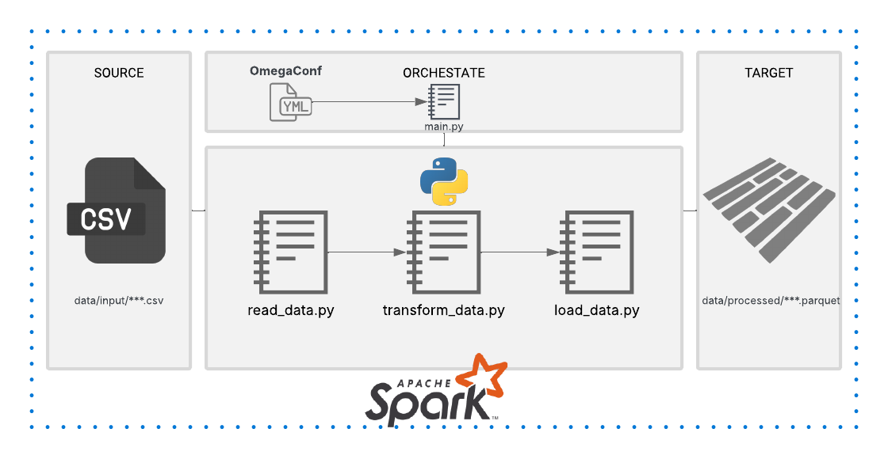

<h1>
  
  APEX – ETL (PySpark)
</h1>


## Descripción
Este proyecto implementa un pipeline ETL utilizando PySpark para extraer, transformar y cargar datos, estructurandose con OmegaConf y con particiones en formato Parquet.

## Configuración
Todos los parámetros del pipeline se definen en `config.yaml`.

## Estructura de la solución

```text
Apex/
├── config/
│   └── config.yaml
├── data/
│   ├── input/
│   └── processed/
├── docs/
├── src/
│   ├── main.py
│   ├── read_data.py
│   ├── transform_data.py
│   └── load_data.py
├── venv/
├── Requirements.txt
└── README.md
```

## Flujo del ETL


### Resumen:

- El ETL se ejecuta a partir de los parámetros definidos en el archivo `config.yaml`, donde se establece el rango de fechas y país a procesar, luego en el archivo `main.py` actúa como orquestador del flujo, inicializando la sesión de Spark y ejecutando de forma secuencial.

- La extracción de datos se realiza en `read_data.py`, donde se lee el archivo CSV de origen. Posteriormente, en `transform_data.py` se ejecutan las reglas que se establecen en la prueba técnica.

- Finalmente, en el archivo `load_data.py` se encarga de estandarizar el dataset final, aplicar los tipos de datos definitivos y particionar por fecha de proceso.

## Ejecución

```bash
#venv\Scripts\activate
python src/main.py
